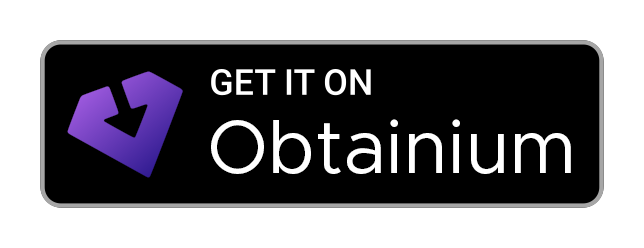

# Unstoppable Wallet

We dream of a world… A world where private property is untouchable and market access is unconditional.

That obsession led us to engineer a crypto wallet that is equally open to all, lives online forever and unconditionally protects your assets. Only the user is in control of the money.

Unstoppable is a powerful non-custodial multi-wallet for Bitcoin, Ethereum, Binance Smart Chain, Avalanche, Solana, Zcash, The Open Network several and other blockchains. It provides non-custodial crypto storage, on-chain decentralized swaps, institutional grade analytics for cryptocurrency markets, extensive privacy controls and human oriented design. 

It is built with care and adheres to best programming practices and implementation standards in cryptocurrency world. Fully implemented on Kotlin.

More at [https://unstoppable.money](https://unstoppable.money)

## Supported Android Versions

Devices with Android versions 8.1 and above

## Download

## Source Code

[https://github.com/horizontalsystems/unstoppable-wallet-android](https://github.com/horizontalsystems/unstoppable-wallet-android)

## License

This software is available under a **tri-license structure**, giving you the flexibility to choose the license that best suits your needs. You may use, modify, and distribute this software under the terms of **any one** of the following licenses:

- **MIT License** - See [LICENSE-MIT](LICENSE-MIT)
- **Apache License 2.0** - See [LICENSE-APACHE](LICENSE-APACHE)
- **BSD 3-Clause License** - See [LICENSE-BSD](LICENSE-BSD)

### How the Tri-License Works

You are **not required** to comply with all three licenses. Simply choose the license that works best for your project:

- **Choose MIT** if you want a short and simple permissive license
- **Choose Apache 2.0** if you need explicit patent grant protection
- **Choose BSD 3-Clause** if you prefer the BSD-style license with its specific clauses

All three licenses are permissive and allow for:
- ✅ Commercial use
- ✅ Modification
- ✅ Distribution
- ✅ Private use

The complete text of all three licenses is available in the main [LICENSE](LICENSE) file, and each license is also available in its own separate file for your convenience. See the [NOTICE](NOTICE) file for additional information.

**Copyright © 2025 Alicefosseneuve lovelustlost, luvelostLOVEFOUND**
